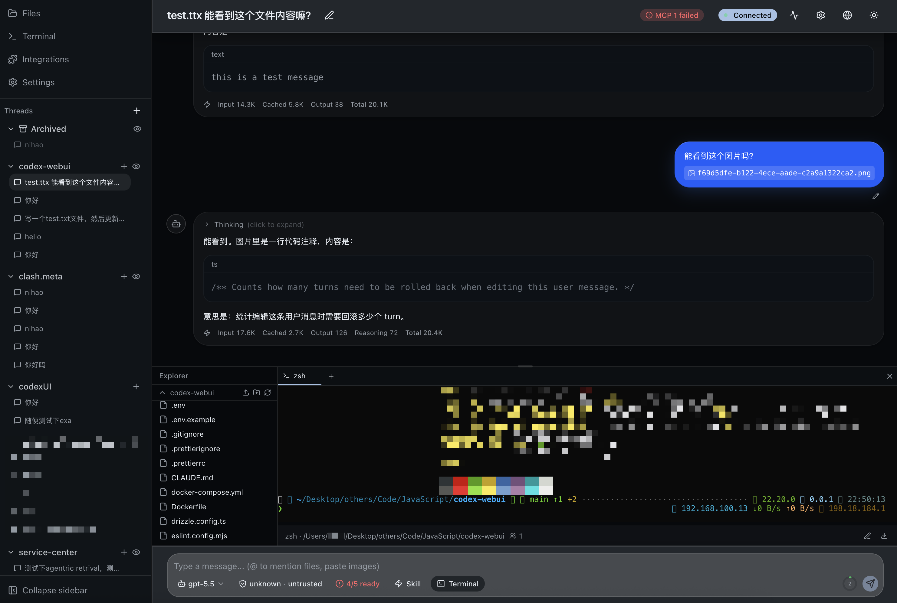
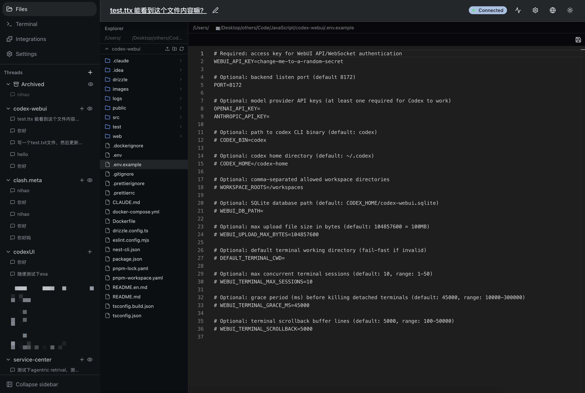
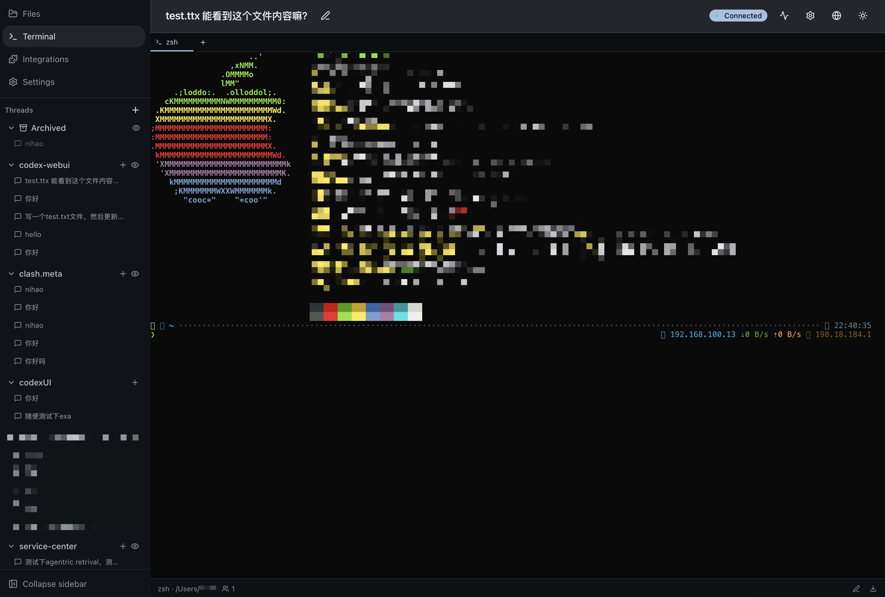
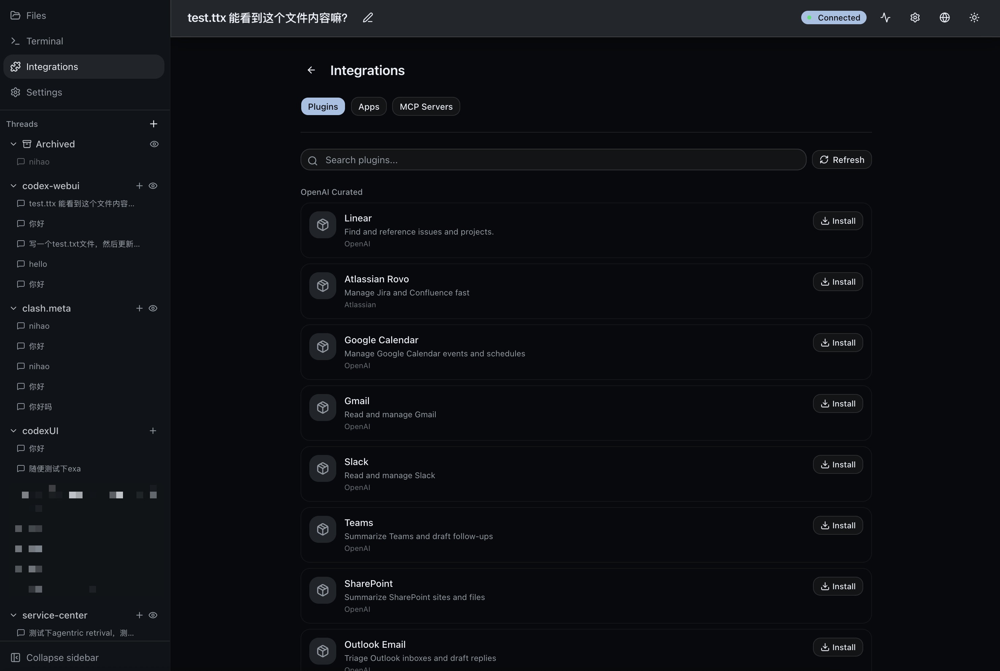

# Codex WebUI

[](https://github.com/LimLLL/codex-webui/pkgs/container/codex-webui)
[](./Dockerfile)

A web frontend for [OpenAI Codex CLI](https://github.com/openai/codex). It brings the CLI experience into the browser with multi-thread concurrency, a file manager, a shared terminal, and multi-tenant SaaS support.

**The backend has been rewritten in Rust (axum + SeaORM)** with **multi-tenant SaaS** support (team isolation, BYOK, horizontal scaling): it talks to `codex app-server` over stdio JSON-RPC and pushes real-time events to a React frontend via Socket.IO. Multi-tenant metadata lives in PostgreSQL/MySQL; distributed coordination (routing / stickiness / event bus / rate limiting) uses Redis. See [`backend-rs/ARCHITECTURE.md`](./backend-rs/ARCHITECTURE.md) for the design and [`backend-rs/README.md`](./backend-rs/README.md) to get started.

[简体中文](./README.md)



## Features

**Chat & Threads**
- Run multiple threads concurrently, grouped by workspace
- Archive, fork, rollback, rename threads
- Markdown rendering + Shiki syntax highlighting
- `@` file mentions, image paste
- Steer/stop running turns

**Approval Flow**
- In-page cards for command execution and file change approvals
- Security policy switching (sandbox levels)
- Multi-device CAS conflict prevention

**File Management & Preview**



- Tree browser with drag-and-drop (dnd-kit)
- Monaco code editor + Git diff split view
- File preview: PDF, images, video, audio, fonts, binary (hex dump)
- Archive browsing: ZIP / TAR(.gz/.bz2/.xz) / RAR / 7z — preview without extracting
- Office editing: DOCX / XLSX / PPTX (via OnlyOffice Document Server, optional)
- Upload / download / rename / copy / move / mkdir

**Terminal**



- Multi-tab shared terminal (portable-pty + xterm.js)
- Reconnect with no output loss
- Headless VT replay

**Integrations & Plugins**



**Other**
- JWT + API Key authentication
- Plugin / MCP server management
- Dark / light theme, i18n (en / zh-CN)
- Responsive layout (mobile + tablet)
- Docker deployment

## Tech Stack

```
Browser
  React 19 · Vite 8 · TanStack (Router + Query + Virtual)
  Zustand · Socket.IO Client · Monaco Editor · xterm.js
  Tailwind CSS 4 · shadcn/ui · Framer Motion · dnd-kit
     ↕  REST + WebSocket
Backend (Rust)
  axum 0.8 · SeaORM 1.1 (PostgreSQL/MySQL) · Redis · tokio
  socketioxide (Socket.IO) · portable-pty + wezterm-term (terminal)
  memberlist 0.8.5 (multi-node gossip) · argon2 · AES-256-GCM
     ↕  stdio JSON-RPC
  codex app-server (child process)
```

## Quick Start

### Prerequisites

- Rust ≥ 1.85 (edition 2024)
- Node.js ≥ 20 + pnpm ≥ 9 (frontend + codex CLI)
- PostgreSQL 16+ (multi-tenant metadata)
- Redis 7+ (optional; without it the server runs in single-node mode — no replicas/failover)
- [Codex CLI](https://github.com/openai/codex) installed and available in PATH

### Docker Deployment (Recommended)

`docker-compose.yml` ships PostgreSQL + Redis. The backend reads all config from `config.toml`, so prepare one and mount it into the container:

```bash
# 1. Prepare config ([database] → postgres service, [redis] → redis service; fill webui_api_key / worker_id / tokens)
cp backend-rs/config.toml.example config.toml
vi config.toml

# 2. Start (builds the multi-stage image: frontend + Rust backend + codex CLI)
docker compose up -d --build
```

The app runs at `http://localhost:8172`. For multi-node horizontal scaling and replica HA, see [`docs/cluster-deploy.md`](./docs/cluster-deploy.md).

### Local Development

```bash
git clone https://github.com/LimLLL/codex-webui.git
cd codex-webui

# 1. Prepare PostgreSQL (required; Redis optional). Run a throwaway instance locally:
docker run -d --name codex-pg -p 5432:5432 \
  -e POSTGRES_USER=codex -e POSTGRES_PASSWORD=codex -e POSTGRES_DB=codex postgres:16-alpine

# 2. Backend
cd backend-rs
cp config.toml.example config.toml   # edit [database] / [redis]
cargo run --release

# 3. Frontend (another terminal, port 5173, proxies to backend)
cd web
pnpm install
pnpm dev
```

Open `http://localhost:5173`.

## Configuration

The backend uses **pure TOML config (no env-var fallback)** — see [`backend-rs/config.toml.example`](./backend-rs/config.toml.example). Lookup order:

1. `$CODEX_WEBUI_CONFIG` (exact path)
2. `$CODEX_HOME/config.toml`
3. `./config.toml`
4. `$HOME/.codex-webui/config.toml`

> ⚠️ The backend **does not read** `DATABASE_URL` / `WEBUI_API_KEY` / `WORKER_ID` or any business env vars — those are legacy leftovers. All business parameters come from TOML only. Under Docker, mount `config.toml` into the container (see Docker section below).

## Project Structure

```
├── backend-rs/           # Rust backend (axum + SeaORM)
│   ├── src/
│   │   ├── api/          # HTTP handlers + Socket.IO gateway
│   │   ├── codex/        # codex process manager + JSON-RPC client
│   │   ├── db/           # SeaORM entities + multi-dialect migrations (PG/MySQL)
│   │   └── services/     # multitenant / process pool / cluster / workspace
│   ├── config.toml.example
│   └── ARCHITECTURE.md   # full architecture doc
├── web/                  # React frontend (Vite)
├── Dockerfile            # multi-stage build (frontend + Rust backend + codex CLI)
└── docker-compose.yml    # PostgreSQL + Redis + codex-webui
```

## Commands

```bash
# Backend (backend-rs/)
cargo run --release                            # run
cargo build --release                          # build
cargo test --lib                               # unit tests
cargo test --features memberlist-backend       # with gossip discovery

# Frontend (web/)
pnpm install
pnpm dev                                       # dev server (port 5173)
pnpm build                                     # build (outputs to backend-rs/public, embedded via rust-embed)
```

## HTTPS / Reverse Proxy

Codex WebUI listens on plain HTTP (default `0.0.0.0:8172`). Use a reverse proxy to terminate HTTPS in production.

> **Note**: `WEBUI_API_KEY` is transmitted in cleartext over HTTP. Always enable HTTPS for public-facing deployments.

### Nginx

```nginx
server {
    listen 443 ssl http2;
    server_name codex.example.com;

    ssl_certificate     /etc/ssl/certs/codex.pem;
    ssl_certificate_key /etc/ssl/private/codex.key;

    client_max_body_size 200m;  # match file upload limit

    location / {
        proxy_pass http://127.0.0.1:8172;
        proxy_set_header Host              $host;
        proxy_set_header X-Real-IP         $remote_addr;
        proxy_set_header X-Forwarded-For   $proxy_add_x_forwarded_for;
        proxy_set_header X-Forwarded-Proto $scheme;
        proxy_set_header X-Forwarded-Host  $host;
    }

    # Socket.IO WebSocket upgrade
    location /socket.io/ {
        proxy_pass http://127.0.0.1:8172;
        proxy_http_version 1.1;
        proxy_set_header Upgrade    $http_upgrade;
        proxy_set_header Connection "upgrade";
        proxy_set_header Host              $host;
        proxy_set_header X-Forwarded-For   $proxy_add_x_forwarded_for;
        proxy_set_header X-Forwarded-Proto $scheme;
        proxy_set_header X-Forwarded-Host  $host;
        proxy_read_timeout 300s;
    }
}

server {
    listen 80;
    server_name codex.example.com;
    return 301 https://$host$request_uri;
}
```

When using Docker Compose, change `proxy_pass` to `http://codex-webui:8172` and replace `ports` with `expose`.

### Caddy

Caddy auto-provisions Let's Encrypt certificates and handles WebSocket upgrades automatically:

```caddyfile
codex.example.com {
    reverse_proxy 127.0.0.1:8172
}
```

### OnlyOffice Note

Behind a reverse proxy, OnlyOffice needs the public URL for save callbacks. Either ensure your proxy forwards `X-Forwarded-Proto` / `X-Forwarded-Host` correctly (auto-detected), or set `general.publicBaseUrl` explicitly in Settings → General.

## License

[AGPL-3.0](./LICENSE)
