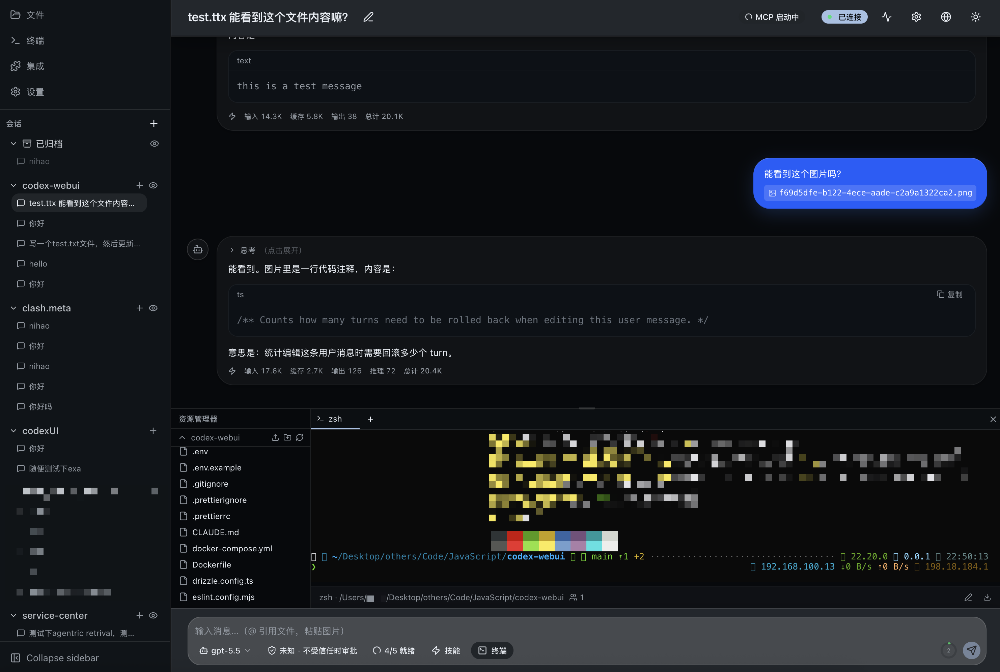
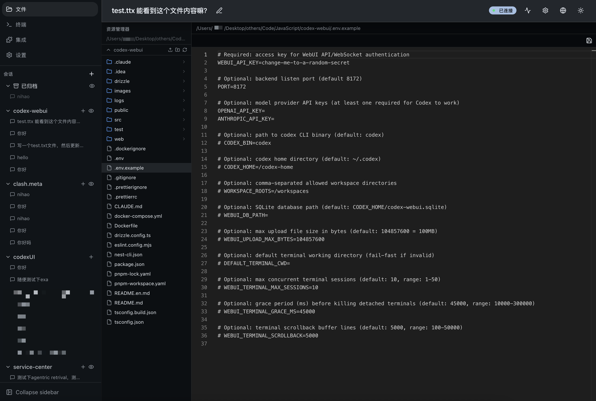
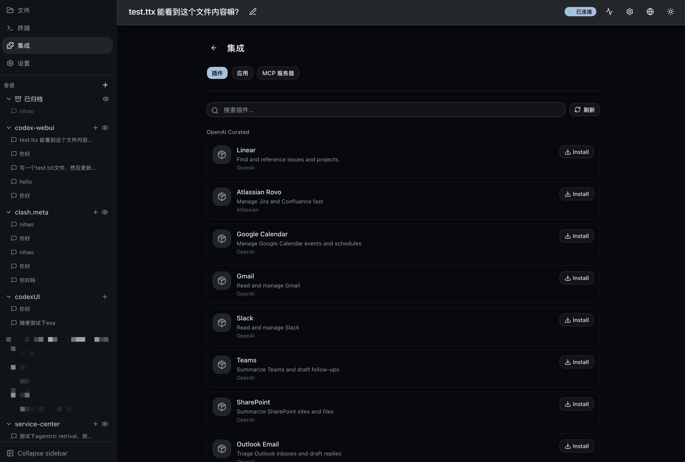

# Codex WebUI

[](https://github.com/LimLLL/codex-webui/pkgs/container/codex-webui)
[](./Dockerfile)

给 [OpenAI Codex CLI](https://github.com/openai/codex) 做的 Web 前端。把命令行交互搬到浏览器里，支持多线程并发、文件管理、终端、多租户 SaaS 等。

**后端已用 Rust（axum + SeaORM）重写**，支持**多租户 SaaS**（team 隔离、BYOK、多机横向扩展）：通过 stdio JSON-RPC 与 `codex app-server` 通信，前端 React + Vite，Socket.IO 实时推送；多租户元数据落 PostgreSQL/MySQL，分布式协调（路由/粘性/事件总线/限流）用 Redis。架构详见 [`backend-rs/ARCHITECTURE.md`](./backend-rs/ARCHITECTURE.md)，后端快速上手见 [`backend-rs/README.md`](./backend-rs/README.md)。

[English](./README.en.md)



## 功能

**对话与线程**
- 多线程并发运行，互不干扰
- 线程按工作区分组，支持归档、fork、回滚、重命名
- Markdown 渲染 + Shiki 代码高亮
- `@` 引用文件、粘贴图片
- 追问（steer）和中断（stop）正在执行的 turn

**审批流程**
- 命令执行、文件变更的审批卡片，直接在页面上操作
- 支持安全策略切换（sandbox 级别）
- 多设备同时在线时的 CAS 防冲突

**文件管理与预览**



- 树形文件浏览器，支持拖拽移动
- Monaco Editor 代码编辑 + Git diff 分栏对比
- 文件预览：PDF、图片、视频、音频、字体、二进制（hex dump）
- 压缩包浏览：ZIP / TAR(.gz/.bz2/.xz) / RAR / 7z，无需解压即可预览内容
- Office 文档编辑：DOCX / XLSX / PPTX（通过 OnlyOffice Document Server，可选集成）
- 上传 / 下载 / 重命名 / 复制 / 移动 / 新建目录

**终端**


- 多 tab 共享终端（portable-pty + xterm.js）
- 断线重连，输出不丢失
- headless VT 回放

**集成与插件**



**其他**
- JWT + API Key 认证
- 插件/MCP 服务器管理
- 深色/浅色主题，中英文切换
- 响应式布局，手机平板也能用
- Docker 一键部署

## 技术栈

```
浏览器
  React 19 · Vite 8 · TanStack (Router + Query + Virtual)
  Zustand · Socket.IO Client · Monaco Editor · xterm.js
  Tailwind CSS 4 · shadcn/ui · Framer Motion · dnd-kit
     ↕  REST + WebSocket
后端（Rust）
  axum 0.8 · SeaORM 1.1（PostgreSQL/MySQL）· Redis · tokio
  socketioxide（Socket.IO）· portable-pty + wezterm-term（终端）
  memberlist 0.8.5（多节点 gossip 探活）· argon2 · AES-256-GCM
     ↕  stdio JSON-RPC
  codex app-server（子进程）
```

## 快速开始

### 前置条件

- Rust ≥ 1.85（edition 2024）
- Node.js ≥ 20 + pnpm ≥ 9（前端 + codex CLI）
- PostgreSQL 16+（多租户元数据）
- Redis 7+（可选；不配则单节点模式，无副本/failover）
- [Codex CLI](https://github.com/openai/codex) 已安装并可用

### Docker 部署（推荐）

`docker-compose.yml` 自带 PostgreSQL + Redis。后端从 `config.toml` 读取所有配置，需准备一份并挂载进容器：

```bash
# 1. 准备配置（[database] 指向 postgres 服务、[redis] 指向 redis 服务，填 webui_api_key / worker_id / token）
cp backend-rs/config.toml.example config.toml
vi config.toml

# 2. 启动（自动构建多阶段镜像：前端 + Rust 后端 + codex CLI）
docker compose up -d --build
```

服务运行在 `http://localhost:8172`。多机横向扩展、副本 HA 见 [`docs/cluster-deploy.md`](./docs/cluster-deploy.md)。

### 本地开发

```bash
git clone https://github.com/LimLLL/codex-webui.git
cd codex-webui

# 1. 准备 PostgreSQL（必需；Redis 可选）。本地可临时用 docker 起：
docker run -d --name codex-pg -p 5432:5432 \
  -e POSTGRES_USER=codex -e POSTGRES_PASSWORD=codex -e POSTGRES_DB=codex postgres:16-alpine

# 2. 后端
cd backend-rs
cp config.toml.example config.toml   # 编辑 [database] / [redis] 段
cargo run --release

# 3. 前端（另开终端，端口 5173，自动代理到后端）
cd web
pnpm install
pnpm dev
```

打开 `http://localhost:5173` 即可使用。

## 配置

后端采用**纯 TOML 配置（无环境变量回退）**，模板见 [`backend-rs/config.toml.example`](./backend-rs/config.toml.example)。查找顺序：

1. `$CODEX_WEBUI_CONFIG`（精确路径）
2. `$CODEX_HOME/config.toml`
3. `./config.toml`
4. `$HOME/.codex-webui/config.toml`

> ⚠️ 后端**不读** `DATABASE_URL` / `WEBUI_API_KEY` / `WORKER_ID` 等业务环境变量——这些是旧架构残留，全部业务参数只从 TOML 读取。Docker 部署时需把 `config.toml` 挂载进容器（见下文 Docker 章节）。

## 项目结构

```
├── backend-rs/           # Rust 后端（axum + SeaORM）
│   ├── src/
│   │   ├── api/          # HTTP handler + Socket.IO 网关
│   │   ├── codex/        # codex 进程管理 + JSON-RPC 客户端
│   │   ├── db/           # SeaORM 实体 + 多方言迁移（PG/MySQL）
│   │   └── services/     # 多租户 / 进程池 / 集群 / workspace
│   ├── config.toml.example
│   └── ARCHITECTURE.md   # 完整架构文档
├── web/                  # React 前端（Vite）
├── Dockerfile            # 多阶段构建（前端 + Rust 后端 + codex CLI）
└── docker-compose.yml    # PostgreSQL + Redis + codex-webui
```

## 常用命令

```bash
# 后端（backend-rs/）
cargo run --release                            # 运行
cargo build --release                          # 编译
cargo test --lib                               # 单元测试
cargo test --features memberlist-backend       # 带 gossip 探活

# 前端（web/）
pnpm install
pnpm dev                                       # 开发模式（端口 5173）
pnpm build                                     # 构建（输出到 backend-rs/public，由 rust-embed 嵌入二进制）
```

## HTTPS / 反向代理

Codex WebUI 自身只监听 HTTP（默认 `0.0.0.0:8172`），生产环境建议用反向代理终止 HTTPS。

> **注意**：`WEBUI_API_KEY` 在纯 HTTP 下明文传输，公网部署务必启用 HTTPS。

### Nginx

```nginx
server {
    listen 443 ssl http2;
    server_name codex.example.com;

    ssl_certificate     /etc/ssl/certs/codex.pem;
    ssl_certificate_key /etc/ssl/private/codex.key;

    client_max_body_size 200m;  # 匹配文件上传限制

    location / {
        proxy_pass http://127.0.0.1:8172;
        proxy_set_header Host              $host;
        proxy_set_header X-Real-IP         $remote_addr;
        proxy_set_header X-Forwarded-For   $proxy_add_x_forwarded_for;
        proxy_set_header X-Forwarded-Proto $scheme;
        proxy_set_header X-Forwarded-Host  $host;
    }

    # Socket.IO WebSocket 升级
    location /socket.io/ {
        proxy_pass http://127.0.0.1:8172;
        proxy_http_version 1.1;
        proxy_set_header Upgrade    $http_upgrade;
        proxy_set_header Connection "upgrade";
        proxy_set_header Host              $host;
        proxy_set_header X-Forwarded-For   $proxy_add_x_forwarded_for;
        proxy_set_header X-Forwarded-Proto $scheme;
        proxy_set_header X-Forwarded-Host  $host;
        proxy_read_timeout 300s;
    }
}

server {
    listen 80;
    server_name codex.example.com;
    return 301 https://$host$request_uri;
}
```

Docker Compose 中使用时，`proxy_pass` 改为 `http://codex-webui:8172`，并将 `ports` 改为 `expose`。

### Caddy

Caddy 自动签发 Let's Encrypt 证书，自动处理 WebSocket 升级：

```caddyfile
codex.example.com {
    reverse_proxy 127.0.0.1:8172
}
```

### OnlyOffice 注意事项

反向代理下 OnlyOffice 需要知道公开 URL 才能回调保存。代理正确传递 `X-Forwarded-Proto` / `X-Forwarded-Host` 即可自动检测；也可在 Settings → General 显式设置 `general.publicBaseUrl`。

## License

[AGPL-3.0](./LICENSE)
